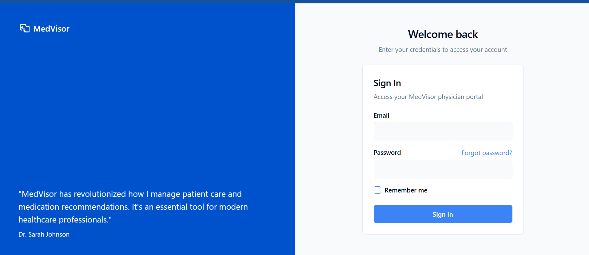
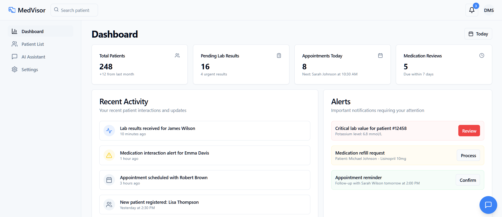
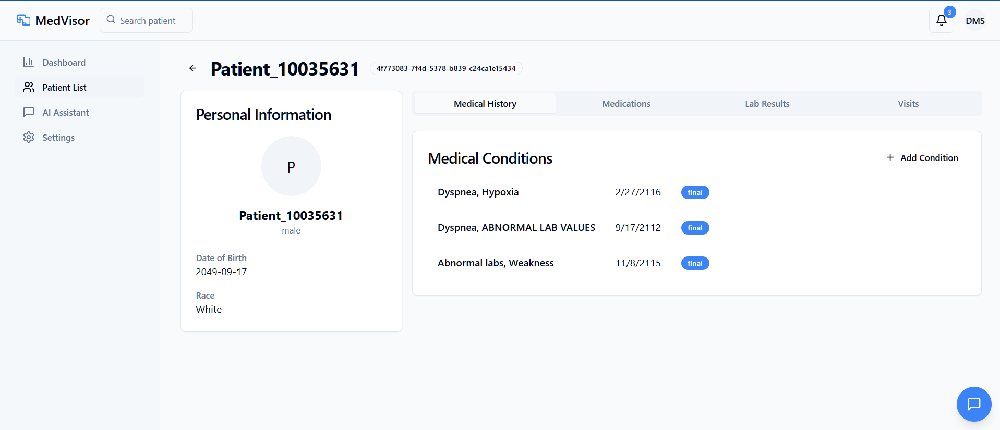
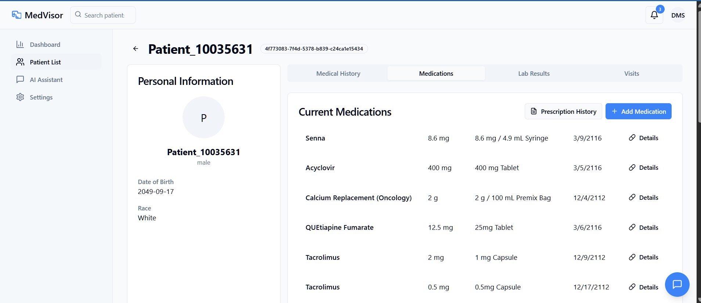
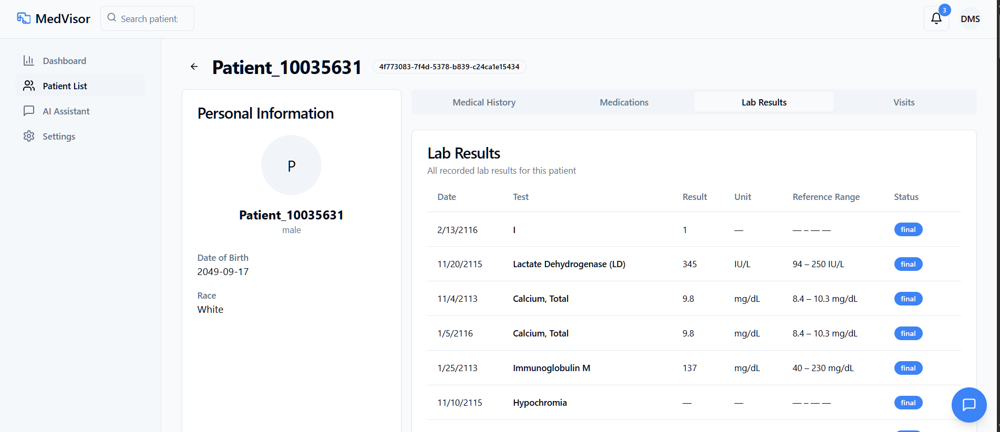
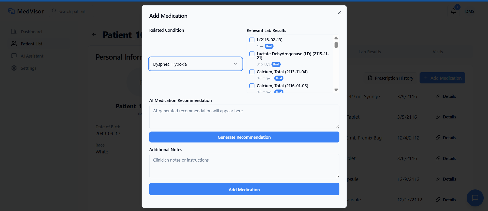
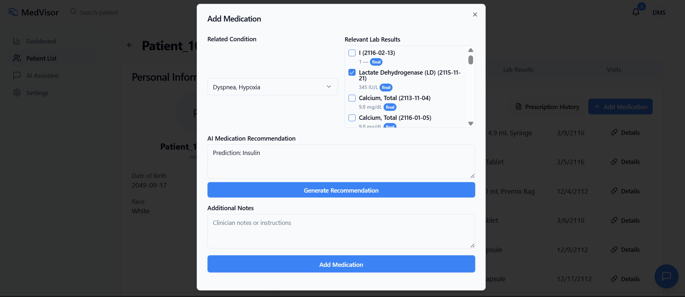

# MedVisor – AI-Powered Medicine Recommendation & Physician Assistant

Welcome to **MedVisor**, a modern AI-powered web application designed to support physicians with intelligent medicine recommendations and administrative task automation. This project empowers healthcare professionals by improving treatment accuracy and saving valuable time through automation.

## 🚀 Features

### 🩺 Personalized Medicine Recommendation
- AI/ML engine that suggests optimized medications based on patient history and clinical data.
- Enhanced decision-making through smart recommendations.

### 🌐 Web-Based Interface
- React.js-powered modern UI for seamless interaction.
- FHIR-compliant integration using [Medplum](https://www.medplum.com/) ensures secure patient data handling.

---

## 🛠 Tech Stack

| Category             | Tools & Frameworks                                 |
|----------------------|-----------------------------------------------------|
| Frontend             | React.js, Tailwind CSS                              |
| Backend              | Node.js, Express.js, Flask                          |
| Machine Learning     | Python, TensorFlow, Scikit-learn                    |
| Database             | PostgreSQL                                          |
| Data Handling        | Pandas, NumPy                                       |
| APIs & Integration   | Medplum API, FHIR standard                          |
| Dev Tools            | VS Code, Jupyter Notebook, GitHub                   |

## Screenshot

|  |  |
|:---------------------------------:|:-------------------------------:|
| *User login screen* | *Dashboard view*   |

|  |  |
|:--------------------------------------:|:------------------------------------------:|
| *Patient List View*     | *Patient Info*          |

|  |  |
|:----------------------------------:|:----------------------------------:|
| *Patient Medication List*     | *Lab Result List*               |

|  |  |
|:-----------------------------------------:|:-------------------------------:|
| *Add Medication*       | *Treatment outcome*   |


---

## 📁 Project Structure

```bash
MedVisor/
├── public/               # Static assets
├── src/
│   ├── components/       # Reusable UI components
│   ├── pages/            # Application pages (Dashboard, Patients, Assistant)
│   ├── services/         # API and FHIR communication logic
│   └── App.js            # Root application component
├── .env                  # Environment variables
├── package.json          # Project metadata and dependencies
└── README.md             # This file
